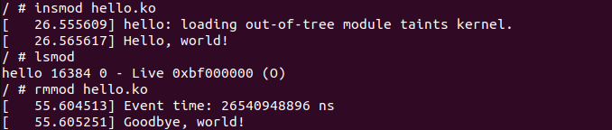
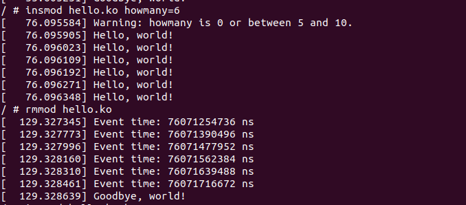
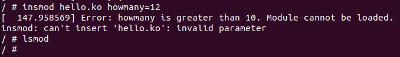
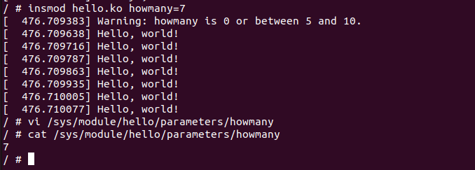
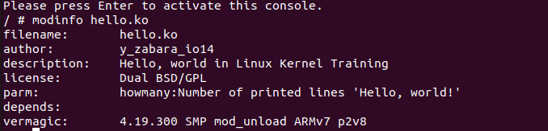

Скріншоти виконання:
- Завантажуємо модуль без вказаного значення параметру

- Завантажуємо модуль з значенням параметру 6

- Завантажую модуль з значенням параметру 12

- Завантажую модуль з значенням параметру 7 та перевіряю значення встановленого параметра в каталозі /sys/module/hello/parameters.

- Виводжу інформацію про свій модуль

